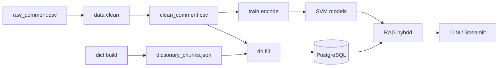

# NLP Sentiment + RAG

Hệ thống phân tích cảm xúc bình luận tiếng Việt/Anh: tiền xử lý → embedding (XLM-RoBERTa / TF-IDF / Doc2Vec) → SVM → **RAG hybrid** (bình luận + từ điển) → giải thích bằng LLM (LM Studio).

> **Một điểm vào duy nhất** — mọi bước chạy qua CLI (từ thư mục gốc `NLP/`):
>
> ```bash
> python -m sentence_list.cli <nhóm-lệnh> ...
> ```

Thư mục `kaggle_output/` (YOLO / VinBig chest X-ray) là dự án tách biệt, **không** dùng chung CLI này.

---

## Yêu cầu

| Thành phần | Ghi chú |
|------------|---------|
| Python 3.10+ | Khuyến nghị 3.11 |
| PostgreSQL + pgvector | Lưu embedding & từ điển cho RAG |
| LM Studio (tùy chọn) | API OpenAI-compatible cho giải thích LLM |
| GPU (tùy chọn) | Tăng tốc encode XLM-RoBERTa (`USE_GPU=1`) |
| YouTube API key (tùy chọn) | Chỉ khi `data crawl` |

---

## Cài đặt

```bash
cd NLP
python -m venv .venv
.venv\Scripts\Activate.ps1    # Windows
# source .venv/bin/activate   # Linux/macOS
pip install -r requirements.txt
```

Tạo file `sentence_list/.env` (mẫu):

```env
# PostgreSQL
DB_HOST=localhost
DB_PORT=5432
DB_NAME=nlp_sentiment_db
DB_USER=postgres
DB_PASSWORD=your_password

# LLM (LM Studio)
LM_STUDIO_URL=http://localhost:1234/v1
LLM_MODEL=Vistral-7B-ChatML-GGUF

# Crawl (tùy chọn)
YOUTUBE_API_KEY=

# Huấn luyện
USE_GPU=1
TRAIN_DEVICE=auto
XLM_BATCH_SIZE=64
PSEUDO_LABEL_MODE=auto
SVM_LEARNING_CURVE=0
LOG_LEVEL=INFO
```

---

## Quy trình đầy đủ

| # | Lệnh | Đầu ra chính |
|---|------|----------------|
| 1 | `python -m sentence_list.cli data crawl` | `sentence_list/raw_data/raw_comment.csv` |
| 2 | `python -m sentence_list.cli data clean` | `sentence_list/clean_data/clean_comment.csv` |
| 3 | `python -m sentence_list.cli dict build` | `sentence_list/clean_dict/dictionary_chunks.json` |
| 4 | `python -m sentence_list.cli train all --device cuda --skip-learning-curve` | `encoded_data/`, `results/svm_models/` |
| 5 | `python -m sentence_list.cli db setup -y` | Schema PostgreSQL |
| 6 | `python -m sentence_list.cli db fill` | Embedding bình luận vào DB |
| 7 | `python -m sentence_list.cli db fill-dict` | Chunk từ điển vào DB *(tùy)* |
| 8 | `python -m sentence_list.cli db eval` | `results/rag/`, `plots/rag/` *(tùy)* |
| 9 | `python -m sentence_list.cli ui` hoặc `predict "..."` | Streamlit / CLI |

### Lộ trình nhanh

Đã có `clean_comment.csv` và không cần crawl/từ điển mới:

```bash
python -m sentence_list.cli train all --device cuda --skip-learning-curve
python -m sentence_list.cli db setup -y
python -m sentence_list.cli db fill
python -m sentence_list.cli ui
```

Chỉ tái chunk từ điển từ CSV có sẵn (bỏ crawl từ điển):

```bash
python -m sentence_list.cli dict build --skip-crawl
```

---

## Tham chiếu CLI

```bash
python -m sentence_list.cli --help
```

### `data` — Thu thập & làm sạch

```bash
python -m sentence_list.cli data crawl
python -m sentence_list.cli data clean
```

### `dict` — Từ điển → JSON chunk

```bash
python -m sentence_list.cli dict build
python -m sentence_list.cli dict build --skip-crawl
```

Chunk gồm `word` + `semantics` (theo cột CSV), phục vụ RAG từ điển.

### `train` — Encode & SVM

```bash
# Khuyến nghị: encode cả 3 model rồi train SVM
python -m sentence_list.cli train all --device cuda --skip-learning-curve

# Từng phần
python -m sentence_list.cli train encode --method xlmroberta
python -m sentence_list.cli train encode --method tfidf --label-mode hybrid
python -m sentence_list.cli train train
```

| Tham số | Ý nghĩa |
|---------|---------|
| `--method` | `tfidf` \| `doc2vec` \| `xlmroberta` \| `all` |
| `--device` | `auto` \| `cuda` \| `cpu` |
| `--label-mode` | `auto`, `teacher`, `lexicon`, `percentile`, `hybrid`, `cluster` |
| `--skip-learning-curve` | Bỏ learning curve SVM (nhanh hơn nhiều) |

**Nhãn giả (TF-IDF / Doc2Vec):** `PSEUDO_LABEL_MODE=auto` dùng nhãn XLM đã encode làm teacher; `train all` encode XLM trước TF-IDF/Doc2Vec.

### `db` — PostgreSQL & đánh giá RAG

```bash
python -m sentence_list.cli db setup -y
python -m sentence_list.cli db fill
python -m sentence_list.cli db fill --force          # nạp lại embedding
python -m sentence_list.cli db fill-dict
python -m sentence_list.cli db eval
python -m sentence_list.cli db eval --max-queries 200 --top-k 5
```

### `predict` / `ui` — Suy luận

```bash
python -m sentence_list.cli predict "Bài hay quá!"
python -m sentence_list.cli predict -i
python -m sentence_list.cli predict -b comments.txt -o results.json
python -m sentence_list.cli predict "..." --encoder xlmroberta --no-llm
python -m sentence_list.cli ui
```

Pipeline: **SVM** (nhãn) + **RAG hybrid** (top-k bình luận tương tự + chunk từ điển) + **LLM** (giải thích, có thể tắt bằng `--no-llm`).

---

## Cấu trúc thư mục

```
NLP/
├── README.md
├── requirements.txt
├── sentence_list/              # Mã nguồn chính
│   ├── cli.py                  # ★ Điểm vào duy nhất
│   ├── __main__.py             # python -m sentence_list.cli
│   ├── config.py
│   ├── data.py                 # crawl + preprocess
│   ├── dictionary.py           # từ điển + chunk + vector search
│   ├── dictionary_expander.py  # mở rộng từ điển khi inference
│   ├── experiments.py          # encode + train SVM
│   ├── pseudo_labeling.py
│   ├── db_ops.py               # setup DB, fill, eval
│   ├── rag_retriever.py
│   ├── rag_metrics.py
│   ├── inference_pipeline.py
│   ├── streamlit_app.py
│   ├── database.py
│   ├── embeddings_manager.py
│   ├── llm_client.py
│   ├── raw_data/
│   ├── clean_data/
│   ├── clean_dict/
│   ├── encoded_data/
│   └── results/
└── kaggle_output/              # YOLO VinBig (không liên quan CLI trên)
```

---

## Kiến trúc (tóm tắt)



- **RAG hybrid:** truy vấn embedding bình luận (pgvector) + chunk từ điển (`dictionary_chunks.json` / bảng `dictionary`).
- **Nhãn cảm xúc:** `praise` | `neutral` | `criticism`.

Cấu hình RAG/LLM: `sentence_list/config.py` (`RAG_CONFIG`, `LLM_CONFIG`, `PSEUDO_LABEL_CONFIG`).

---

## Xử lý sự cố

| Vấn đề | Gợi ý |
|--------|--------|
| Lỗi `triu` / SciPy với Gensim | Đã pin `gensim==4.3.3` trong `requirements.txt` |
| Doc2Vec/TF-IDF lệch lớp praise | Dùng `train all` + `PSEUDO_LABEL_MODE=auto`; tránh chỉ `cluster` |
| `USE_GPU=1` nhưng vẫn CPU | PyTorch thường là bản `+cpu` từ pip. Kiểm tra: `python -m sentence_list.cli train gpu-check`. Cài CUDA: `pip uninstall torch -y` rồi `pip install -r requirements-gpu.txt` |
| Không có GPU | `--device cpu` hoặc `USE_GPU=0` |
| SVM learning curve quá lâu | `--skip-learning-curve` hoặc `SVM_LEARNING_CURVE=0` |
| Đổi dữ liệu / model | Chạy lại `train all` → `db fill` (và `fill-dict` nếu đổi từ điển) |
| `predict` / UI không khớp encoder | Cùng loại với embedding đã nạp (`--encoder xlmroberta` mặc định) |
| `--help` lỗi font trên Windows | Đặt `PYTHONIOENCODING=utf-8` hoặc dùng terminal UTF-8 |

---

## Phát triển

Chỉnh sửa mã trong `sentence_list/`. Không chạy các script đã gộp/xóa (`main.py`, `crawl_sentence.py`, `setup_database.py`, …) — luôn dùng `python -m sentence_list.cli`.
